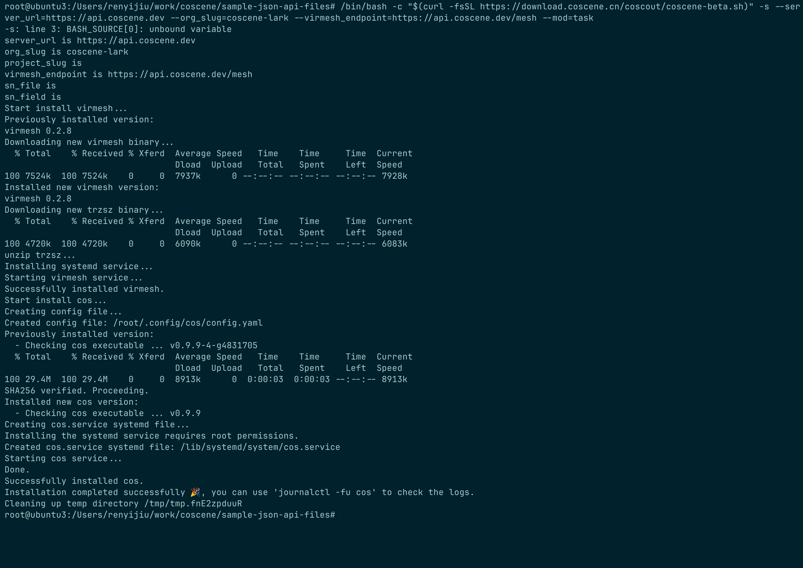

## 在您的组织中添加设备
### 为您的设备安装刻行的端侧软件
进入【组织管理】-【设备】-【添加设备】，获取设备 Agent 安装命令


安装命令支持指定相关的设备 ID 文件路径以及关联字段名，若不设定则会随机生成 ID 绑定当前设备。


在机器上打开命令行终端，粘贴上图复制的安装命令，在命令后面添加 `--mod=task` 参数，安装 cos Agent 至机器端。等待几分钟后即可在组织设备中查看到对应的设备信息。



在网页端查看相关的设备，若未出现相关设备，第一次安装过程较慢，请耐心等待 1 分钟后刷新网页。找到对应的机器，点击【准入数采】准许设备进行数据采集操作。

### 将设备添加至项目

进入对应的项目，选择【项目设备】-【添加设备】-【从组织设备选择】，选择添加刚才安装的设备到当前项目。


## 配置采集规则

进入【组织管理】-【设备】-【编辑数采规则】，配置整体的数采规则信息。


`upload_files` 用来配置刻行端侧组件扫描的文件夹地址，您可以配置多个文件夹地址用来上传机器人端侧的数据。
```yaml
event_code:
  enabled: false
mod:
  conf:
    enabled: true
    upload_files:
        - folder1_path // 需要扫描的文件夹
        - folder2_path
        - file_path // 需要额外上传的文件地址，请填写绝对路径
  name: 'default' # mod 名称
```

具体的配置文件信息介绍，请查看文档[数采规则](../4-recipes/3-device/4-device-collector.md)
