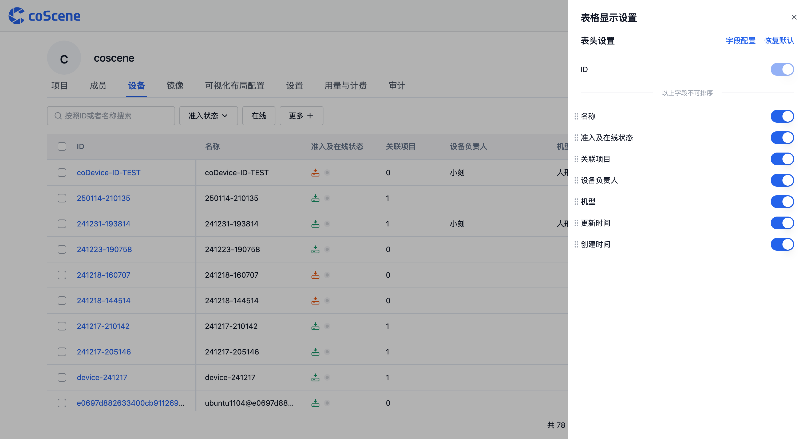
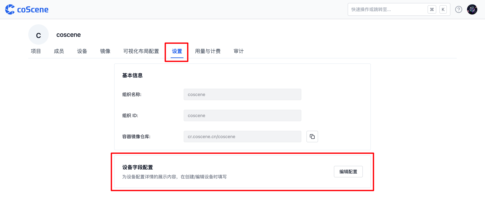
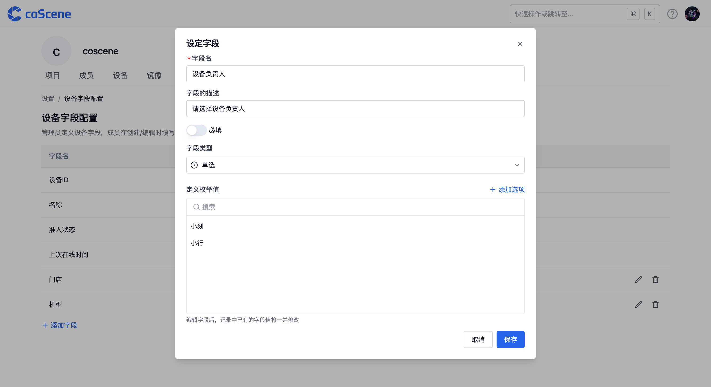
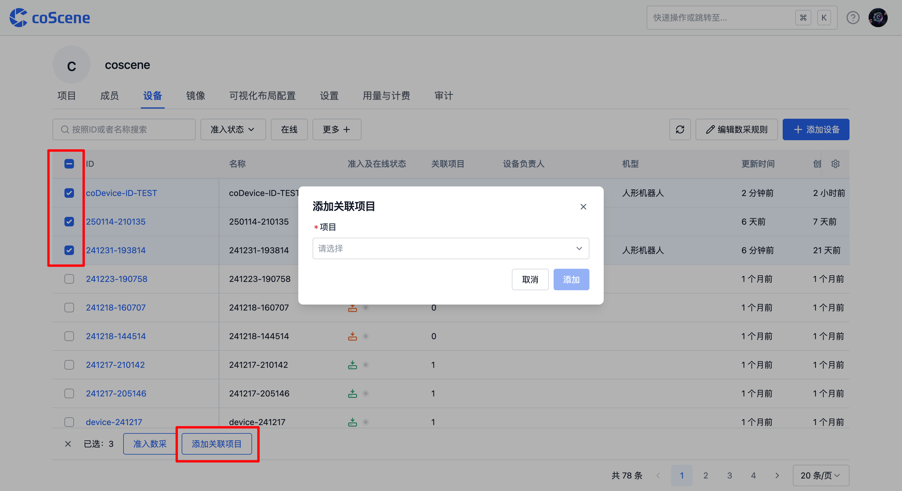
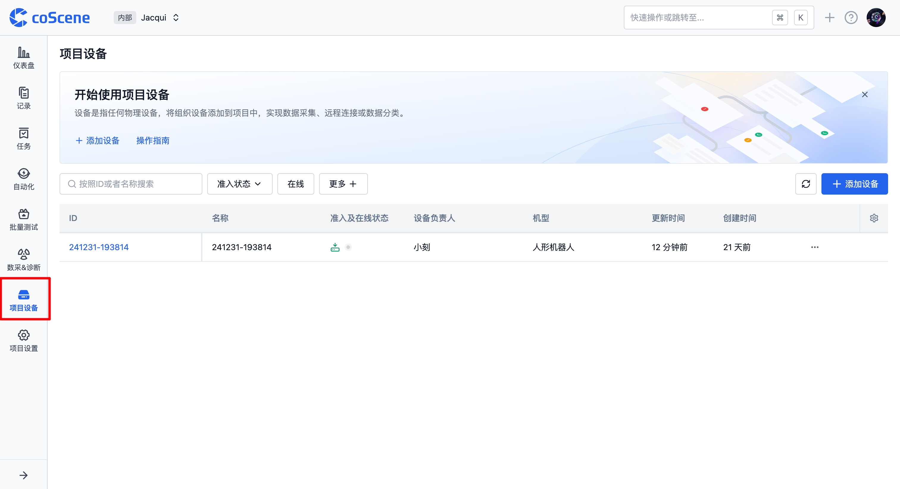

# 管理设备

## 设备管理基础

设备在组织层面进行统一管理，只有组织成员及以上权限的用户可进行相关操作。在「组织管理 - 设备」页面能够查看现有的设备列表。

## 设备信息筛选与表格设置

<div style={
{ 
    padding: '12px 16px', backgroundColor: '#EFF6FF', borderRadius: '4px',  border: '1px solid', borderColor: '#2563EB', color: '#111827' }
}>
<p style={{margin: 0}}>🤖 权限：所有**组织用户**均可查看过滤设备信息</p>
</div>

### 过滤设备信息

系统默认支持对「设备 ID」、「准入状态」、「在线状态」这 3 个字段进行筛选，在「更多」选项中，还能选择设备的自定义字段进行过滤操作，以满足用户更个性化的信息查找需求。


### 表格设置

当设备字段较多时，可利用表格右上角的设置按钮，按照个人偏好对表格显示字段进行排序、隐藏等操作，方便用户聚焦关键信息。同时，也可通过【恢复默认】将表格恢复到初始显示状态




## 设备自定义字段管理

<div style={
{ 
    padding: '12px 16px', backgroundColor: '#EFF6FF', borderRadius: '4px',  border: '1px solid', borderColor: '#2563EB', color: '#111827' }
}>
<p style={{margin: 0}}>🤖 权限：仅**组织管理员**拥有设定设备自定义字段的权限</p>
</div>

* **入口：**&#x901A;过「组织管理 - 设置 - 设备字段配置 - 编辑配置」路径进入设置页面，管理员可依据实际需求添加相关设备字段。保存设置后，设备信息展示中会相应出现这些自定义字段。

* **注意事项：**&#x82E5;管理员删除某一设备自定义字段，该字段的所有数据将一并删除且无法恢复，因此操作时务必谨慎。






## 设备信息编辑

<div style={
{ 
    padding: '12px 16px', backgroundColor: '#EFF6FF', borderRadius: '4px',  border: '1px solid', borderColor: '#2563EB', color: '#111827' }
}>
<p style={{margin: 0}}>🤖 权限：**组织成员及以上角色**可对设备信息进行编辑更新</p>
</div>
<br />
在设备列表中选中需操作的设备后点击【编辑】按钮，或者在设备详情页面点击【编辑】按钮，都能对设备的各项信息进行修改操作。


## 设备与项目关联操作

<div style={
{ 
    padding: '12px 16px', backgroundColor: '#EFF6FF', borderRadius: '4px',  border: '1px solid', borderColor: '#2563EB', color: '#111827' }
}>
<p style={{margin: 0}}>🤖 权限：**组织成员及以上角色**可以分配设备到某个项目中</p>
</div>

### 分配设备到项目

设备添加到项目后，若安装了数据采集客户端，客户端将拉取项目中已开启的规则进行自动监听与诊断，也可在项目中创建采集任务采集数据。

在设备列表选定设备后点击【添加关联项目】按钮；



或者在项目中点击【添加设备】按钮来拉取组织中的设备，均可完成设备与项目的关联。



### 从项目移除设备

若项目不再需要某设备，可在项目中将其【从本项目移除】。移除后设备仍保留在组织项目中，但项目不再接收该设备采集的数据，后续若有需要仍可再次添加该设备到本项目进行数据采集。


## 设备准入

<div style={
{ 
    padding: '12px 16px', backgroundColor: '#EFF6FF', borderRadius: '4px',  border: '1px solid', borderColor: '#2563EB', color: '#111827' }
}>
<p style={{margin: 0}}>🤖 权限：**仅组织管理员**可进行设备准入操作</p>
</div>
<br />

完成添加设备后，设备列表会出现【准入】的操作按钮，在设备详情页还可单独准入「数据采集」和「远程控制」模块。


「数据采集」准入后，机器端程序将按规则采集数据并自动上传至对应项目；

「远程控制」准入后，用户可通过刻行平台对机器进行 SSH 连接、实时可视化等操作。

### 查看数采客户端日志

在设备端执行以下命令，可查看数据采集客户端的日志信息，方便用户了解数据采集过程中的情况。

```go
journalctl --user-unit=cos -f -n 50
```

### 卸载数据采集、远程控制客户端

在设备端中，执行以下命令可卸载数据采集、远程控制客户端，执行过程中需观察输出直至卸载流程完成

```yaml
/bin/bash -c "$(curl -fsSL https://download.coscene.cn/coscout/uninstall.sh)"
```


## 删除设备

<div style={
{ 
    padding: '12px 16px', backgroundColor: '#EFF6FF', borderRadius: '4px',  border: '1px solid', borderColor: '#2563EB', color: '#111827' }
}>
<p style={{margin: 0}}>🤖 权限：当设备**已准入时，只有组织管理员**可删除；若设备**无准入信息，组织成员及以上角色**均可删除</p>
</div>
<br />

在设备列表选择要删除的设备并点击【删除设备】，经二次确认后即可删除。当删除设备之后

1. 已准入设备将取消准入，无法自动上传数据

2. 组织中将清除该设备及来自设备端的请求

3. 记录中将无法添加该设备

4. 记录中将无法查看该设备的详细信息


<br />


***

通过以上步骤和操作说明，您可全面地对设备进行管理操作，确保设备在组织和项目中的有效应用与维护。

如有任何疑问，请随时联系我们获取支持。

