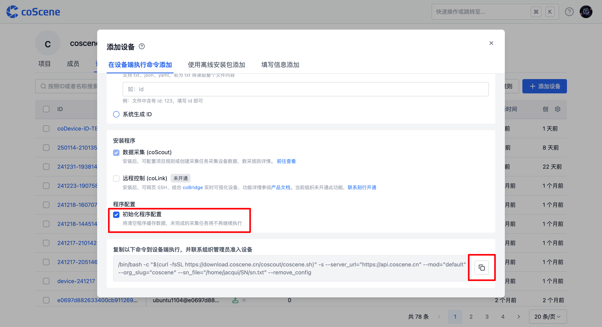
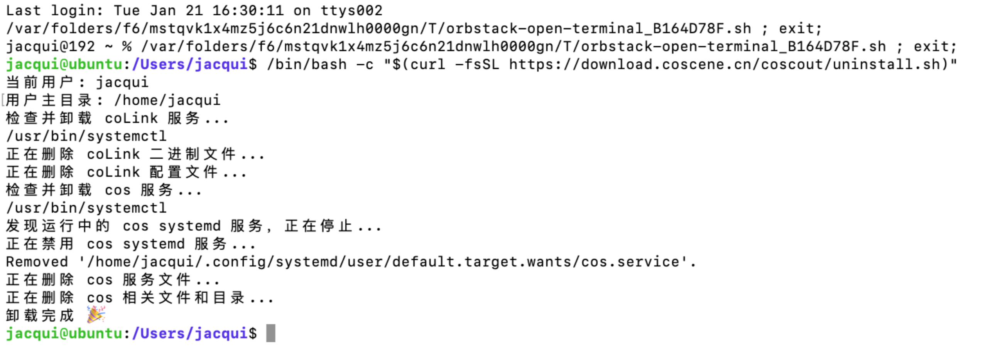

# 换机、升级、卸载流程指南

## 概述

本篇换机流程适用于当设备需要更换上位机、修改设备 ID、升级客户端或卸载客户端时，为运维人员、技术支持人员及研发人员提供详细的操作步骤及问题解决方法，确保设备在平台上的稳定运行与有效管理。


## 换机流程

### 适用情况

当设备进行上位机更替或设备 ID 修改时，需遵循换机流程，重新执行命令安装注册设备。

### 操作步骤

1. 在「组织设备」页面，点击【添加设备】按钮

   

2. 获取安装命令

  - 确保即将安装的设备的设备 ID 相关信息无误

  - 勾选需要安装的客户端选项

  - 勾选上初始化程序配置，此勾选将清除旧配置文件

      

3. 设备终端执行命令

   打开设备终端，将复制的命令粘贴并执行，执行过程需保证设备网络连接正常且终端环境符合要求

   


4. 重新准入设备，安装完成后，联系组织管理员在平台设备管理页面，对设备进行重新准入操作，使设备恢复正常使用。

   


## 原机版本升级流程

### 适用情况

当设备仅需进行软件版本升级，而不涉及上位机或设备 ID 变更时，采用原机版本升级流程。

### 操作步骤

1. 在「组织设备」页面，点击【添加设备】按钮

   

2. 获取安装命令

  1. 确保即将安装的设备的设备 ID 相关信息无误

  2. 勾选需要安装的客户端选项

  3. 在添加设备页面的程序配置区域，取消勾选【初始化程序配置】，否则可能导致正在处理的采集任务异常。

   

3. 设备终端执行命令

  1. 打开设备终端，将复制的命令粘贴并执行，执行过程需保证设备网络连接正常且终端环境符合要求

   

4. 重新准入设备，安装完成后，联系组织管理员在平台设备管理页面，对设备进行重新准入操作，使得升级后的设备正常运行于平台。

   


## 设备端卸载客户端流程

1. 在命令行中执行以下命令

```yaml
/bin/bash -c "$(curl -fsSL https://download.coscene.cn/coscout/uninstall.sh)"
```

2. 执行过程中需密切观察输出，直至卸载流程完成，确保 coLink 服务、cos 服务及其相关配置文件和目录等均被成功移除

   


3. 此时平台中仍保留着设备数据在后端数据库中，若平台中不再需要这台设备，可在组织设备中点击【删除】按钮来删除设备

   


## 常见问题解答

1. **设备 ID 异常，与预设的 ID 不符，显示为一串 UUID**

- 若设备 ID 显示为一串 UUID 且与预设 ID 不符，请确认执行设备安装命令的用户为 tyzc，而非 root，并且安装命令中需带有参数 `--mod=agi`，以此保证设备 ID 的正确识别与设置。


2. **云端创建了采集任务，但是设备没有上传数据**

  - 检查设备是否联网，确保网络稳定以支持数据上传。

  - 检查设备端对应时间段是否有数据产生，确认设备数据生成功能正常。

  - 检查是否有两台设备使用相同的设备 ID，如有则需更换其中一台设备的 SN 后重新安装，避免数据冲突。

  - 检查是否将更换下来的上位机直接用于另一台机器，若存在此情况，需在该上位机上执行卸载命令或重新安装，确保设备环境独立正确。


***

通过以上指南，可帮助你在平台中顺利完成设备更换、升级及卸载等操作，保障设备管理的高效与稳定。

如有任何疑问，请随时联系我们获取支持。
