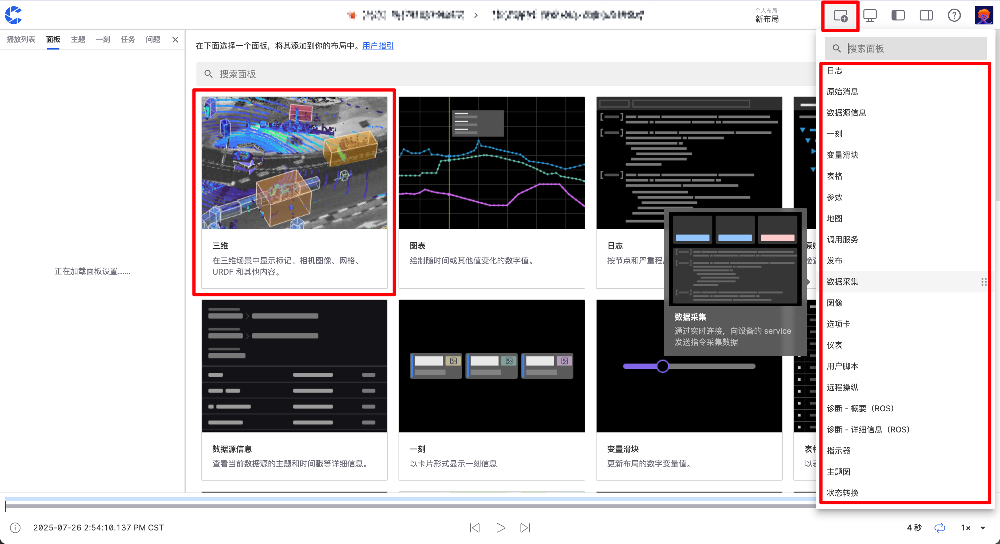
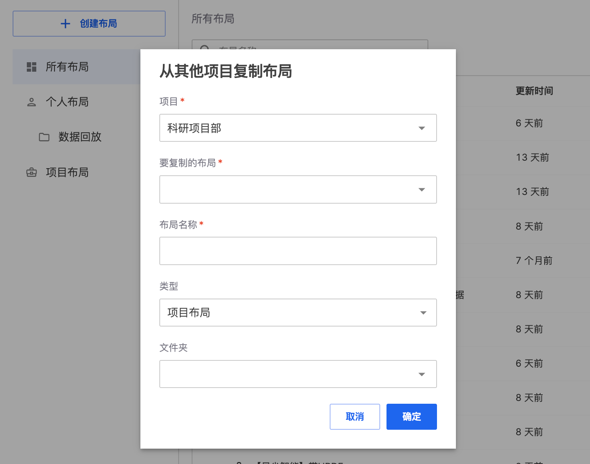
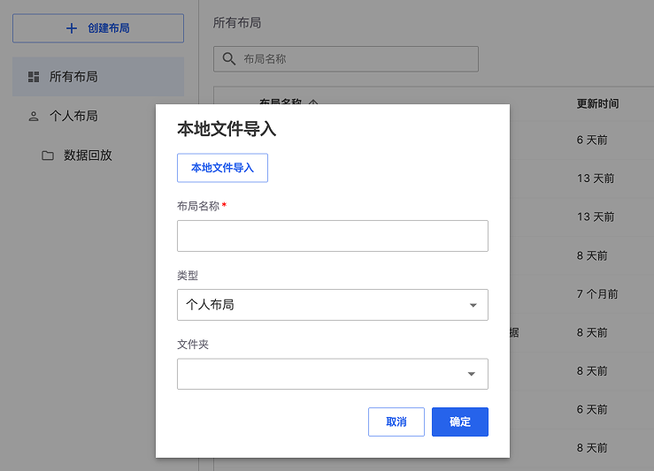

# 布局

「布局」是可视化界面中安排元素的方式。它可与项目成员共享，有助于将设备数据以直观的可视化方式呈现，助力用户高效查看与分析各类多模态数据。

## 创建布局

点击可视化界面右上角的【布局】进入布局管理页，可通过以下方式创建布局：【创建空白布局】、【从其他项目复制布局】或【本地文件导入】。

### 创建空白布局

先填新的布局名称、类型（个人布局或项目布局），以及用于存储布局的可选文件夹

确定后，进入新布局配置页，您可从页面中直接选择感兴趣的面板，或点击右上角的添加面板按钮选择更多面板。

:::info
🤖 要想在一个布局中使用较多的面板，请使用 **选项卡** 面板功能。按住 Shift 并点击多个面板并选择“按选项卡分组”，即可立即组织它们，无需手动拖动。
:::

- 在配置完成后，可点击顶部的【保存更改】按钮，将布局永久保存；
- 若未点击保存更改，将会存储在当前浏览器的缓存中，以便于下次可视化数据使用；
- 点击【撤销更改】按钮，布局将恢复到上一次的存储状态。

### 从其他项目复制布局

通过复制已有项目的布局，您可以快速获取一个基础的、符合部分需求的布局框架，然后在此基础上进行修改和调整，大大节省了布局设计的时间，提升工作效率。

### 本地文件导入

通过本地文件导入可从当前电脑的文件系统中选择一个布局  json 文件导入。

## 布局使用场景

### 个人布局

个人布局只有您可以访问 - 其他任何人都无法查看、加载或编辑。

您的个人布局的更改将同步到您的所有电脑，并可复制为项目布局以共享使用。

### 项目布局

项目布局提供了团队整理一组规范的布局来完成项目内常见的可视化数据方式。

当项目公开时，项目布局也将一并公开，以供游客浏览可视化数据时使用合适的布局。

## 布局的管理

可以直接从左侧浏览布局文件夹，它们分为：所有、个人、项目。

### 使用布局

在管理布局中，找到想要使用的布局，点击布局名称前的【使用布局】按钮，即可切换为对应布局

:::info
🤖 系统会记住您上次在**当前项目中使用的布局**，下次执行可视化操作时，将默认使用上次的布局。
:::

### 重命名布局
修改布局的名称以便更好地识别和分类。

### 复制布局
将布局复制为个人 / 当前项目布局。

### 移动布局
将布局移动到当前分类（个人/项目）下的其他文件夹中。

### 导出布局
将布局导出为 json 文件，以便分享或在其他环境中使用。

### 删除布局
删除不再需要的布局，保持布局列表的整洁和高效。
:::info
🤖 若是删除项目布局，可访问此项目的用户（项目管理员、项目成员、项目只读成员、公开项目的游客）将无法使用此布局。
:::

---
